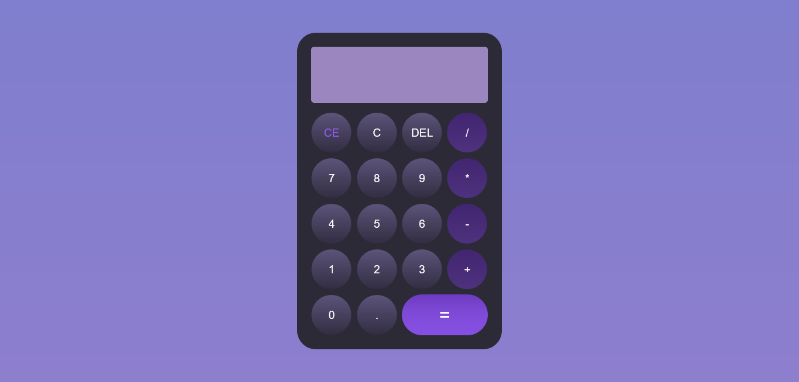

# Calculator Devoped with OOP paradigm

## Table of contents

- [Overview](#overview)
  - [The challenge](#the-challenge)
  - [Screenshot](#screenshot)
  - [Links](#links)
- [My process](#my-process)
  - [Built with](#built-with)
- [Author](#author)

## Overview

### The challenge

Users should be able to:

- View the optimal layout for the site depending on their device's screen size
- Perform every commun mathematical operation
- Use the keyboard to interact with the calculator **(in progress)**

### Screenshot

### Links

- Live Site URL: [Here](https://heiderick13.github.io/calculator-oop/)

## My process

### Built with

- CSS custom properties
- Flexbox
- Grid layout
- Vanilla JavaScript
- Objetc Oriented Programming

## Author

- Website - [Marcelo Oliveira](www.linkedin.com/in/marcelo-ferreira-de-oliveira)
